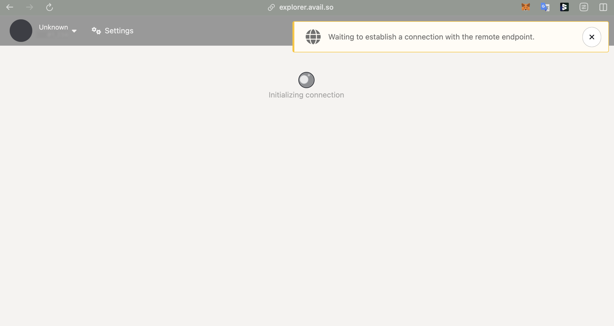
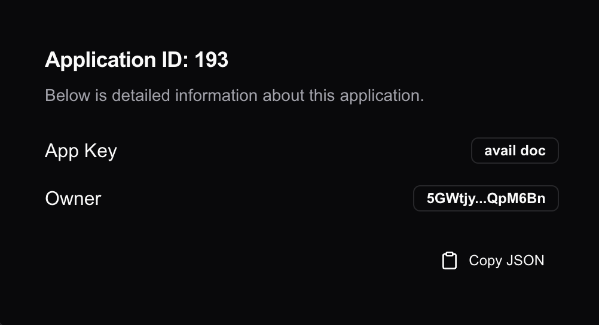
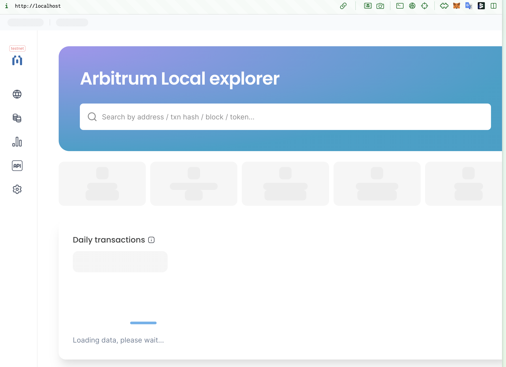

# Prerequisites
## docker
## avail
- set up an avail account with avail tokens
    - set up subwallet
    - get testnet token from [avail faucet](https://faucet.avail.tools/)
        -  issue : the avail faucet "see transaction details" button takes me to "https://explorer.avail.so", which seems to load indefinitely 
        
        
       However, SubWallet directs to this explorer "https://avail-turing.subscan.io/", which works correctly.

- get avail app id
    - created an app id on avail testnet
    


## Arbitrum Sepolia
get arbitrum sepolia testnet token with ethglobal faucet

# Download avail-nitro-node docker image
## Step-1: Download the avail-nitro-node image from docker hub
No issues. The Docker image version specified in the documentation is the latest one.
# Deploy Rollup Contracts
No issues. The contract tag version specified in the documentation is the latest one.
## Step-1: Download the avail-nitro-contracts with Avail DA
no issues. the contract tag version used in the doc is the latest one
## Step-2: Create .env file
-  issue: there is no `.env.sample file`. there is only `.env.sample.goerli` file
## Step-3: Create .script/config.ts file
-  issue: The title should be corrected to "Create scripts/config.ts file" instead of "Create .script/config.ts file."
## Step-4: Deploy your chain's base contracts to Arbitrum Sepolia!
```bash
yarn build:forge:yul
yarn run deploy-eth-rollup --network arbSepolia
```
-  issue: Got a provider error code=UNPREDICTABLE_GAS_LIMIT when running yarn run deploy-eth-rollup --network arbSepolia.
- solution: Deployment succeeded after increasing the max fee per gas to 10 Gwei.
    ```bash
    yarn run deploy-eth-rollup --network arbSepolia
    yarn run v1.22.22
    warning package.json: License should be a valid SPDX license expression
    $ hardhat run scripts/createEthRollup.ts --network arbSepolia
    Calling createRollup to generate a new rollup ...
    Deployment failed: cannot estimate gas; transaction may fail or may require manual gas limit [ See: https://links.ethers.org/v5-errors-UNPREDICTABLE_GAS_LIMIT ] (reason="execution reverted", method="estimateGas", transaction={"from":"0xc84F029A6107a947240c5955EA6CC90561878451","to":"0xE917553b67f630C3982236B6A1d7844B1021B909","value":{"type":"BigNumber","hex":"0x01cdda4faccd0000"},"data":"0x331f9b0b000000000000000000000000000000000000000000000000000000000000002000000000000000000000000000000000000000000000000000000000000001000000000000000000000000000000000000000000000000000000000000000540000000000000000000000000000000000000000000000000000000000001999900000000000000000000000000000000000000000000000000000000000000000000000000000000000000000000000000000000000000000000000000000001000000000000000000000000000000000000000000000000000000003b9aca0000000000000000000000000000000000000000000000000000000000000005a00000000000000000000000001234123412341234123412341234123412341234000000000000000000000000000000000000000000000000000000000000b2fa00000000000000000000000000000000000000000000000000000000000000c800000000000000000000000000000000000000000000000000000000000000000000000000000000000000000000000000000000000000000de0b6b3a7640000da4e3ad5e7feacb817c21c8d0220da7650fe9051ece68a3f0b1c5d38bbb27b21000000000000000000000000123412341234123412341234123412341234123400000000000000000000000000000000000000000000000000000000000000000000000000000000000000000000000000000000000000000000000000cb6baa00000000000000000000000000000000000000000000000000000000000001c000000000000000000000000000000000000000000000000000000000000000000000000000000000000000000000000000000000000000000000000000001680000000000000000000000000000000000000000000000000000000000000000c00000000000000000000000000000000000000000000000000000000000151800000000000000000000000000000000000000000000000000000000000000e1000000000000000000000000000000000000000000000000000000000000002477b22636861696e4964223a31333333313337302c22686f6d657374656164426c6f636b223a302c2264616f466f726b426c6f636b223a6e756c6c2c2264616f466f726b537570706f7274223a747275652c22656970313530426c6f636b223a302c2265697031353048617368223a22307830303030303030303030303030303030303030303030303030303030303030303030303030303030303030303030303030303030303030303030303030303030222c22656970313535426c6f636b223a302c22656970313538426c6f636b223a302c2262797a616e7469756d426c6f636b223a302c22636f6e7374616e74696e6f706c65426c6f636b223a302c2270657465727362757267426c6f636b223a302c22697374616e62756c426c6f636b223a302c226d756972476c6163696572426c6f636b223a302c226265726c696e426c6f636b223a302c226c6f6e646f6e426c6f636b223a302c22636c69717565223a7b22706572696f64223a302c2265706f6368223a307d2c22617262697472756d223a7b22456e61626c654172624f53223a747275652c22416c6c6f774465627567507265636f6d70696c6573223a66616c73652c2244617461417661696c6162696c697479436f6d6d6974746565223a66616c73652c22496e697469616c4172624f5356657273696f6e223a31302c22496e697469616c436861696e4f776e6572223a22307831323334313233343132333431323334313233343132333431323334313233343132333431323334222c2247656e65736973426c6f636b4e756d223a307d7d0000000000000000000000000000000000000000000000000000000000000000000000000000000000000000000000000000000000000000020000000000000000000000001234123412341234123412341234123412341234000000000000000000000000123451234512345123451234512345123451234500000000000000000000000000000000000000000000000000000000000000010000000000000000000000001234123412341234123412341234123412341234","accessList":null}, error={"name":"ProviderError","_stack":"ProviderError: execution reverted\n    at HttpProvider.request (nitro-contracts/node_modules/hardhat/src/internal/core/providers/http.ts:96:21)\n    at processTicksAndRejections (node:internal/process/task_queues:95:5)\n    at async EthersProviderWrapper.send (nitro-contracts/node_modules/@nomiclabs/hardhat-ethers/src/internal/ethers-provider-wrapper.ts:13:20)","code":-32000,"_isProviderError":true}, code=UNPREDICTABLE_GAS_LIMIT, version=providers/5.7.2)
    ```
-  issue: there is a typo in `scripts/rollupCreation.ts` file
    the constant `MAX_FER_PER_GAS` should be changed to `MAX_FEE_PER_GAS`


contract deployed successfully after increasing the max fee per gas
```bash
Inbox (proxy) Contract created at address: 0x7Bb4714Cd79f3b6c6058AFf8c2b7d32046347D1E
Outbox (proxy) Contract created at address: 0xB2B3341dE935f0f672B103246047129e78EaFD6e
rollupEventInbox (proxy) Contract created at address: 0x4cd5a8F8918B857f244713Bd7a61b549061D6587
challengeManager (proxy) Contract created at address: 0x4adD1Cb26b113deC91Edb3d92f640c33714EF9c1
AdminProxy Contract created at address: 0xe0699DF1fE0a413979B0B3F9D38F2892E7853d92
SequencerInbox (proxy) created at address: 0x2A66A508F6B8c149DDBbAa1B7b7bf292C80af4C3
Bridge (proxy) Contract created at address: 0x1E5a668F4eF686d963cc61fa578251E99885a702
DABridge (proxy) Contract created at address: 0xAD252B2cCc3Cc7099FDcB9AAc366DF9C8D3A0473
ValidatorUtils Contract created at address: 0x0911837C1cdC5b5C6ACDBc887Be223A05c3c6FDD
ValidatorWalletCreator Contract created at address: 0x367Ad15A9aDFF8C2D1D51892F2d717bF2B86a3aD
```
# Spin up the chain using orbit-setup-script
## Step-1: Download orbit-setup-script
## Step-2: Create nodeConfig.json in ./config
## Step-3: Create orbitSetupScriptConfig.json in ./config
## Step-4: Update docker-compose file of orbit-setup-script
## Step-5: Run your chain
```
cd orbit-setup-script
docker-compose up -d
```
the chain is running at localhost!

-  issue: For Docker Desktop (v20.10.0 or later), use docker compose up -d instead of docker-compose up -d.
